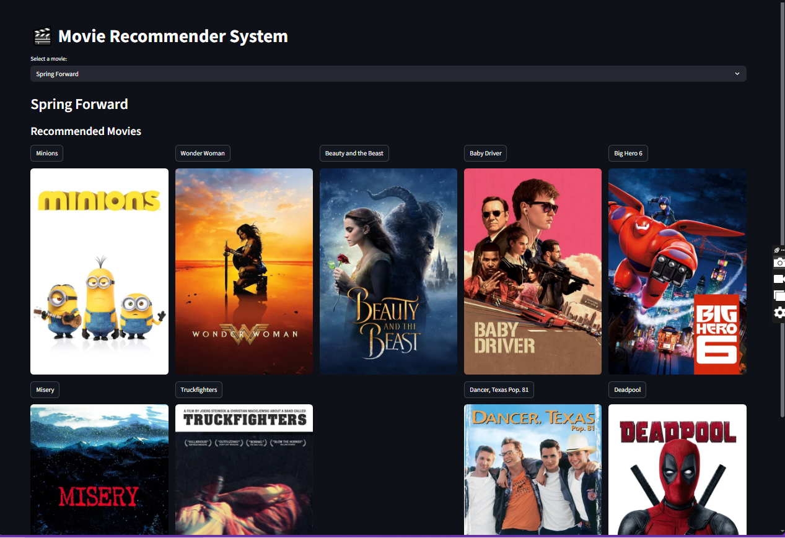
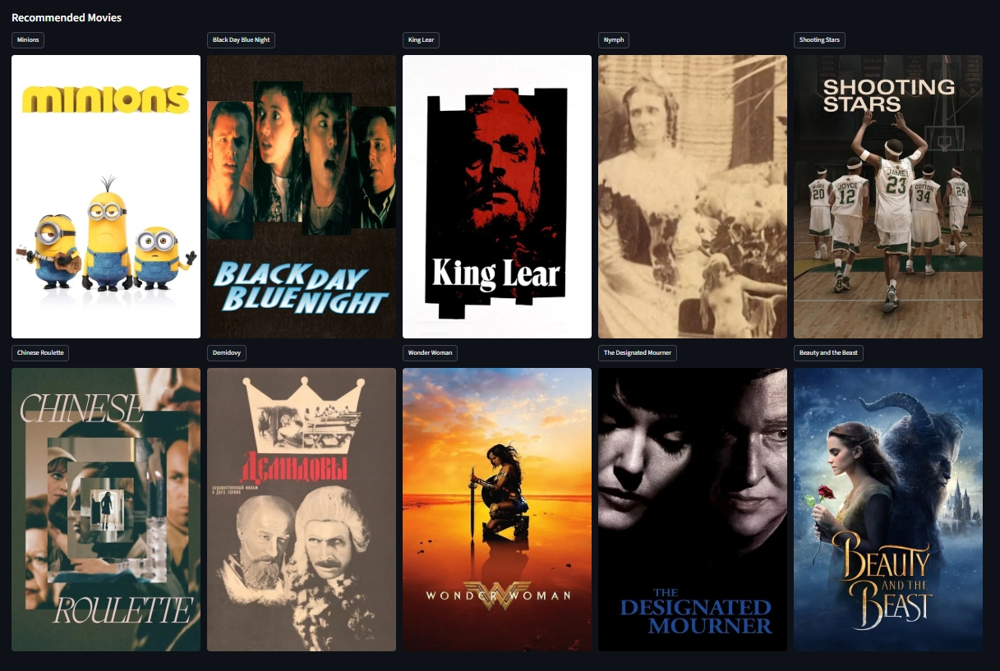

# 🎬 Movie Recommender System

A hybrid movie recommender system built with **Python**, **Streamlit**, and **TMDB API**.  
It combines **content-based filtering** (movie overview, genres, tagline) with **popularity** and **vote average** to provide smarter movie recommendations.  

Posters and backdrops are fetched dynamically from **TMDB**.  

---

## 🚀 Features

- **Hybrid Recommendations:** Content similarity + popularity + vote average.  
- **TMDB Posters:** Displays movie posters and backdrops dynamically.  
- **Dropdown Select:** Search movies via a dropdown for better UX.  
- **Side-by-Side Posters:** Recommendations displayed in columns.  
- **Fully Cache Optimized:** Uses `st.cache_data` to speed up repeated operations.  

---

## 🛠️ Tech Stack

- Python 3.10+  
- Streamlit  
- Pandas, Numpy  
- Scikit-learn (TF-IDF, Cosine Similarity)  
- Requests (for TMDB API)  
- python-dotenv (for TMDB API key management)  

---

## 📂 Files

- `main.py` - Streamlit app  
- `df.pkl` - Preprocessed movie dataframe  
- `tfidf_matrix.pkl` - TF-IDF matrix of movie tags  
- `indices.pkl` - Mapping of movie titles to dataframe indices  
- `.env` - TMDB API key (not committed to GitHub)  

---

## ⚡ Installation

1. Clone the repository:

```bash
git clone https://github.com/maroofiums/Movies_Recommended_System
cd Movies_Recommended_System
````

2. Install dependencies:

```bash
pip install -r requirements.txt
```

3. Create a `.env` file in the project root:

```env
TMDB_API_KEY=your_tmdb_api_key_here
```

4. Run the app:

```bash
streamlit run main.py
```

---

## 🧩 How It Works

1. **Data Preparation:**

   * Movie metadata is preprocessed (`overview`, `genres`, `tagline`)
   * TF-IDF vectorization on movie tags for content similarity

2. **Hybrid Recommendation:**

   * Cosine similarity of content (tags)
   * Normalized popularity & vote average
   * Weighted hybrid score = `0.6 content + 0.2 popularity + 0.2 vote`

3. **Display:**

   * Dropdown for movie selection
   * Poster and backdrop fetched from **TMDB API**
   * Recommendations displayed in **5-column layout** with posters

---

## 📸 Screenshots




---

## ⚠️ Notes

* Make sure your **TMDB API key** is valid.
* Posters/backdrops depend on TMDB availability.
* Large dataset (~45k movies) may require caching for speed.

---
